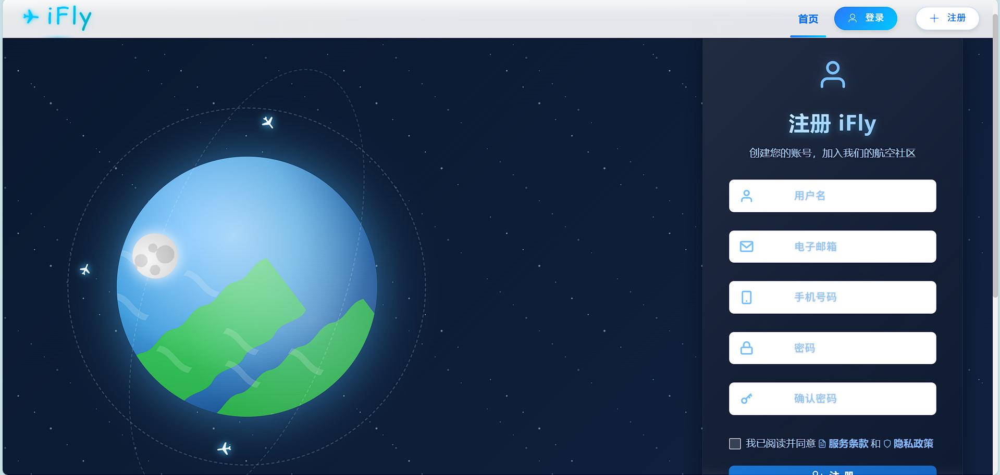
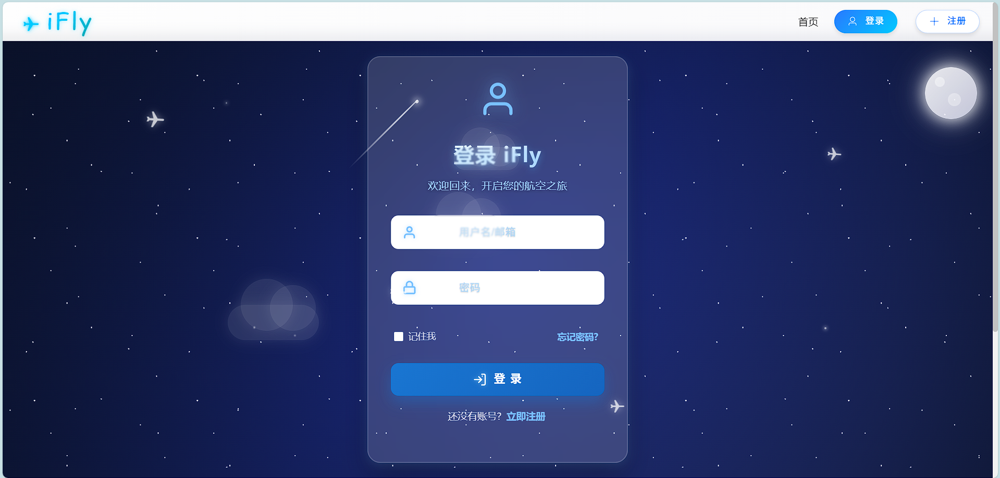
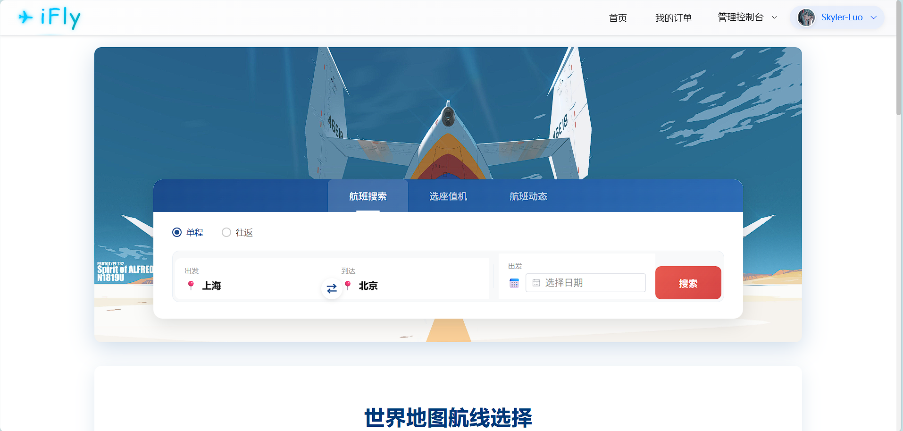

<h1 align="center">
  
  &nbsp;iFly 飞机订票系统
</h1>


iFly 是一个功能完善的飞机订票系统，采用前后端分离架构，后端基于 Django 5.x + Django REST Framework 构建 RESTful API，前端使用 Vue.js 3.x + Element Plus 实现响应式用户界面。

系统涵盖航班查询与筛选、在线订票与选座、订单管理、在线支付、电子值机、机票改签与退票、乘客信息管理、航班动态通知等核心业务功能，同时提供完整的管理后台，支持航班管理、订单处理、用户管理、数据分析与商业智能报表等运营功能。

## 📋 目录

- [截图展示](#-截图展示)
- [功能特性](#-功能特性)
- [技术栈](#-技术栈)
- [项目结构](#-项目结构)
- [快速开始](#-快速开始)
- [API 文档](#-api-文档)
- [配置说明](#-配置说明)
- [许可证](#-许可证)

## 📸 截图展示

<div align="center">


*注册*


*登录*


*首页*


</div>


## ✨ 功能特性

### 用户端功能

| 功能模块 | 说明 |
|---------|------|
| 航班搜索 | 支持出发地、目的地、日期、价格等多条件筛选 |
| 在线订票 | 选择航班、填写乘客信息、座位选择 |
| 支付中心 | 支持多种支付方式完成订单支付 |
| 在线值机 | 提前值机、选座、获取电子登机牌 |
| 改签退票 | 机票改签申请、退票处理、差价结算 |
| 乘客管理 | 添加/编辑常用乘客信息，快速下单 |
| 订单中心 | 查看历史订单、订单详情、电子行程单 |
| 航班动态 | 实时航班状态推送、延误/取消通知 |
| 站内消息 | 系统公告、个人消息、客服沟通 |

### 管理端功能

| 功能模块 | 说明 |
|---------|------|
| 数据仪表盘 | 核心业务指标概览、实时数据监控 |
| 航班管理 | 航班信息增删改查、状态管理、定价设置 |
| 订单管理 | 订单查询、状态处理、退改审批 |
| 用户管理 | 用户列表、权限配置、账户状态管理 |
| 收入统计 | 销售额统计、收入趋势、支付渠道分析 |
| 商业智能 | 航线分析、客流预测、运营报表 |
| 系统设置 | 参数配置、操作日志、系统维护 |

## 🛠️ 技术栈

### 后端
| 技术 | 版本 | 说明 |
|------|------|------|
| Python | 3.10+ | 运行时环境 |
| Django | 5.1.4 | Web 框架，提供 ORM、Admin、中间件等核心功能 |
| Django REST Framework | 3.15.0 | RESTful API 框架，支持序列化、视图集、权限控制 |
| SimpleJWT | 5.3.1 | JWT 认证，支持 Token 刷新与验证 |
| django-filter | 24.1 | 查询过滤器，支持多条件筛选 |
| drf-yasg | 1.21.8 | 自动生成 Swagger/ReDoc API 文档 |
| django-cors-headers | 4.4.0 | 跨域资源共享支持 |
| Channels | 4.0.0 | WebSocket 支持，用于实时通知推送 |
| Pillow | 10.3.0 | 图片处理，用于用户头像上传与处理 |

### 前端
| 技术 | 版本 | 说明 |
|------|------|------|
| Vue.js | 3.2.13 | 前端框架，采用 Options API 风格 |
| Vue Router | 4.x | 路由管理，支持懒加载与导航守卫 |
| Vuex | 4.x | 状态管理，集中管理用户登录态与全局数据 |
| Element Plus | 2.10.2 | UI 组件库，提供表单、表格、弹窗等组件 |
| Axios | 1.10.0 | HTTP 客户端，封装请求拦截与响应处理 |
| ECharts | 5.6.0 | 数据可视化，用于管理端图表展示 |
| Leaflet | 1.9.4 | 地图组件，用于航线可视化展示 |
| date-fns | 4.1.0 | 日期处理工具库 |

### 数据库
| 环境 | 数据库 | 说明 |
|------|--------|------|
| 开发环境 | SQLite | 轻量级，无需额外配置，开箱即用 |
| 生产环境 | PostgreSQL | 高性能、高并发，支持复杂查询与事务 |

## 📁 项目结构

```
iFly/
├── iFly/                    # Django 项目配置
│   ├── settings.py          # 开发环境配置
│   ├── settings_production.py # 生产环境配置
│   ├── urls.py              # 主路由配置
│   └── wsgi.py / asgi.py    # 服务器入口
│
├── accounts/                # 用户认证与乘客管理
├── flight/                  # 航班数据管理
├── booking/                 # 订单与机票
├── payments/                # 支付处理
├── notifications/           # 系统通知
├── user_messages/           # 站内消息
├── admin_api/               # 管理员专用接口
├── core/                    # 核心工具与中间件
├── analytics/               # 数据分析
│
├── ifly_web/                # Vue.js 前端项目
│   ├── src/
│   │   ├── views/           # 页面组件
│   │   ├── components/      # 可复用组件
│   │   ├── services/        # API 服务层
│   │   ├── store/           # Vuex 状态管理
│   │   ├── router/          # 路由配置
│   │   └── utils/           # 工具函数
│   └── package.json
│
├── media/                   # 用户上传文件
├── logs/                    # 日志文件
├── requirements.txt         # Python 依赖
└── manage.py                # Django 管理脚本
```

## 🚀 快速开始

### 环境要求
- Python 3.10+
- Node.js 16+
- npm 或 yarn

### 后端安装

```bash
# 1. 克隆项目
git clone <repository-url>
cd iFly

# 2. 创建虚拟环境
python -m venv venv

# Windows
venv\Scripts\activate

# Linux/macOS
source venv/bin/activate

# 3. 安装依赖
pip install -r requirements.txt

# 4. 配置环境变量
copy .env.example .env
# 编辑 .env 文件，设置 SECRET_KEY 等配置

# 5. 数据库迁移
python manage.py migrate

# 6. 创建管理员账户
python manage.py createsuperuser

# 7. 生成测试数据（可选）
python create_test_data.py

# 8. 启动开发服务器
python manage.py runserver
```

### 前端安装

```bash
# 1. 进入前端目录
cd ifly_web

# 2. 安装依赖
npm install

# 3. 启动开发服务器
npm run serve

# 4. 生产构建
npm run build
```

### 服务地址

| 服务 | 地址 |
|------|------|
| Django 后端 | http://127.0.0.1:8000 |
| Vue 前端 | http://localhost:8080 |
| Django Admin | http://127.0.0.1:8000/admin/ |

## 📖 API 文档

### 在线文档

启动后端服务后，可通过以下地址访问自动生成的 API 文档：

| 文档类型 | 地址 | 说明 |
|---------|------|------|
| Swagger UI | http://127.0.0.1:8000/api/docs/ | 交互式文档，可直接在页面测试 API |
| ReDoc | http://127.0.0.1:8000/api/redoc/ | 阅读友好的文档格式 |
| CoreAPI | http://127.0.0.1:8000/docs/ | DRF 内置文档 |

### 认证方式

系统支持两种认证方式：

```bash
# Token 认证
Authorization: Token <token>

# JWT 认证
Authorization: Bearer <jwt>
```

### 主要 API 端点

| 模块 | 端点 | 说明 |
|------|------|------|
| 认证 | `/api/token/` | JWT 获取 |
| 认证 | `/api/token/refresh/` | JWT 刷新 |
| 用户 | `/api/accounts/` | 用户管理 |
| 乘客 | `/api/accounts/passengers/` | 乘客信息 |
| 航班 | `/api/flights/` | 航班查询 |
| 订单 | `/api/bookings/orders/` | 订单管理 |
| 机票 | `/api/bookings/tickets/` | 机票管理 |
| 支付 | `/api/payments/` | 支付处理 |
| 通知 | `/api/notifications/` | 系统通知 |
| 消息 | `/api/messages/` | 站内消息 |
| 分析 | `/api/analytics/` | 数据分析 |
| 管理 | `/api/admin/` | 管理员接口 |

## ⚙️ 配置说明

### 环境变量

```bash
# Django 密钥（生产环境必须更换）
SECRET_KEY=your-secret-key-here

# 调试模式（生产环境设为 False）
DEBUG=True

# 允许的主机
ALLOWED_HOSTS=localhost,127.0.0.1

# 数据库配置（可选，默认 SQLite）
# DATABASE_URL=sqlite:///db.sqlite3
```

## 📊 数据模型

### 核心模型关系

```
User (accounts)
├── Passenger (1:N) - 乘客信息
├── Order (1:N) - 订单
└── Notification (1:N) - 通知

Order (booking)
└── Ticket (1:N) - 机票
    └── Flight (N:1) - 航班
```

### 业务流程

1. **订票流程**：搜索航班 → 选择航班 → 填写乘客信息 → 创建订单 → 支付 → 出票
2. **值机流程**：选择机票 → 选择座位 → 完成值机 → 获取登机牌
3. **退票流程**：选择机票 → 申请退票 → 退款处理 → 恢复座位
4. **改签流程**：选择机票 → 选择新航班 → 支付差价 → 生成新机票

## 🔒 安全特性

- JWT + Token 双认证模式
- 身份证号、手机号格式验证
- CORS 跨域保护
- CSRF 防护
- 敏感数据加密存储

## 📝 许可证

本项目采用 [LICENSE](LICENSE) 许可协议。

---

<p align="center">
  ⭐ 如果这个项目对你有帮助，请点个 Star 支持一下！ ⭐
</p>